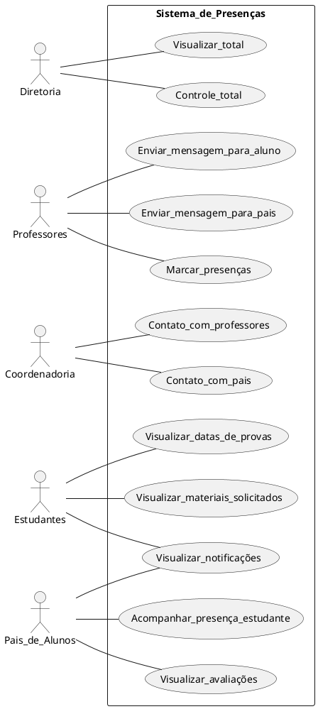
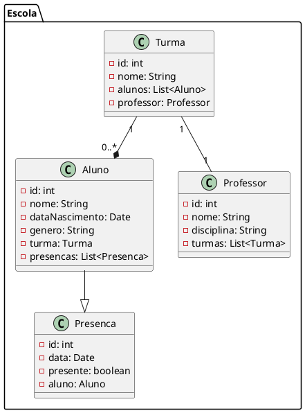
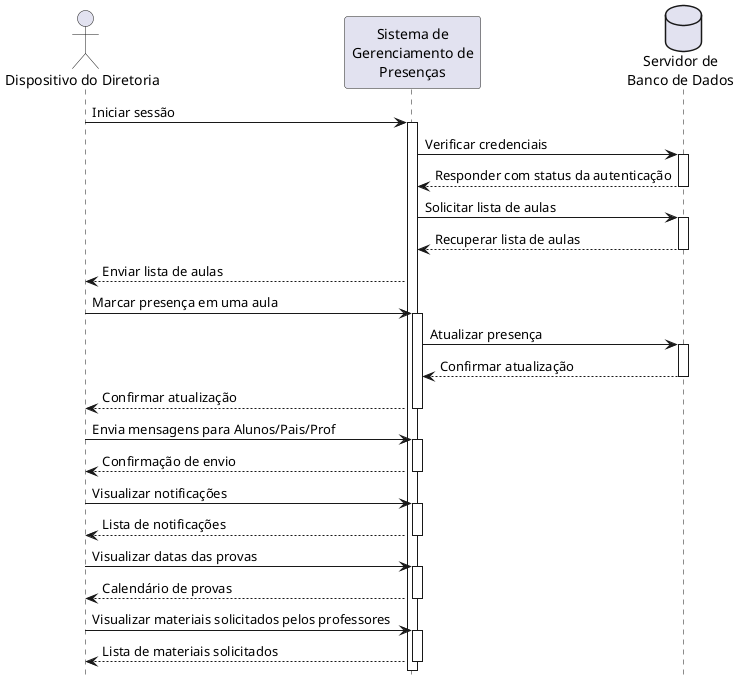
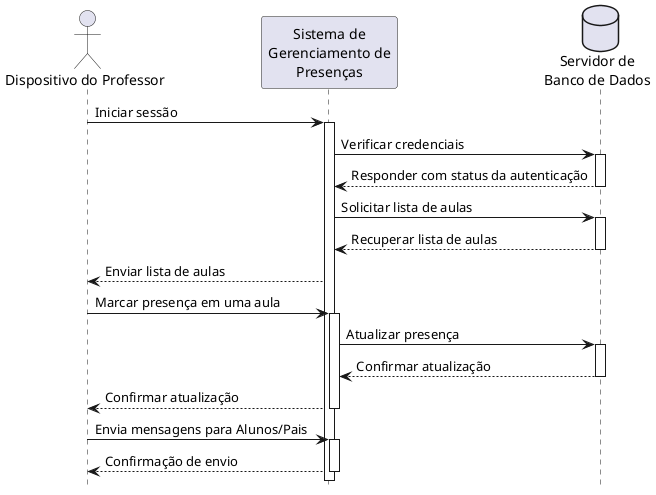
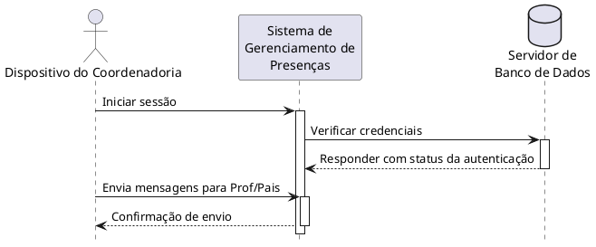
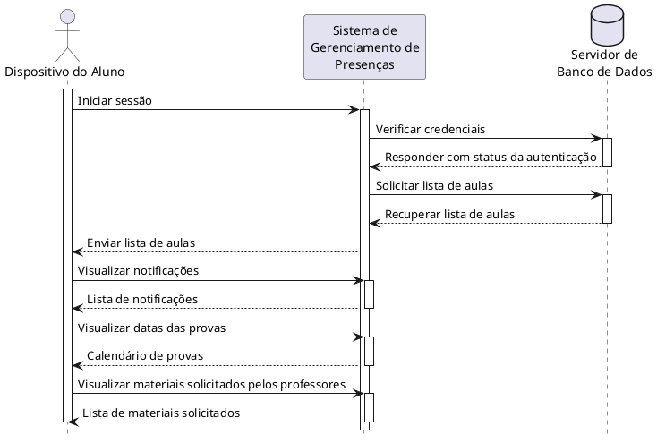
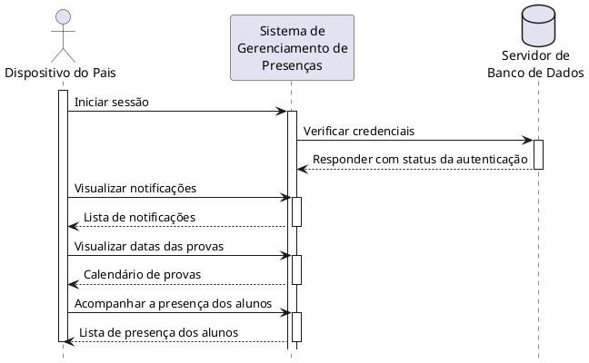
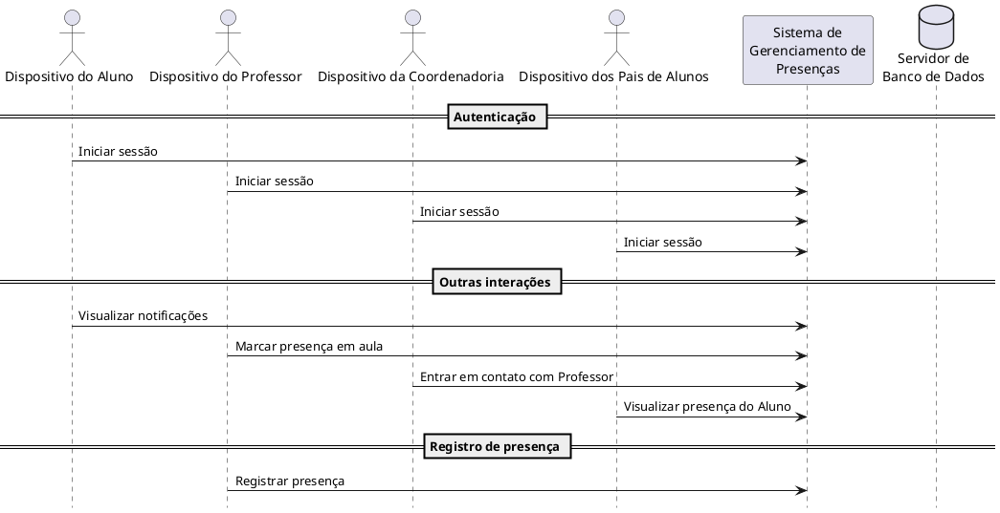
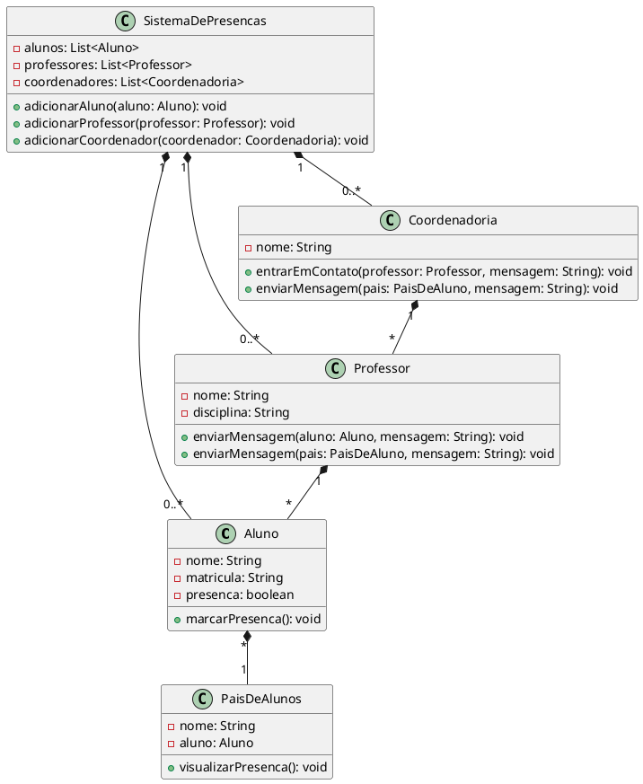

## 2 Diagrama de caso de uso

## 3 Modelo de dominio

## 4 Diagrama de sequencias

## 4.1 Diretoria

## 4.2 Professor

## 4.3 Coordenadoria

## 4.4 Aluno

## 4.5 Pais de Alunos

## 5 Diagrama de sequencia do sistema

## 6 Diagrama de classes de projeto
